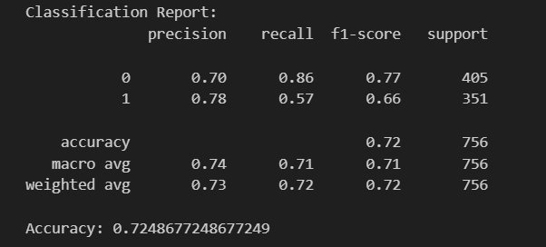

# Water-potability-prediction-
This work uses over 3700 water samples from a variety of water sources including surface water and subsurface (boreholes) samples to predict water potability. Surface water here refers to water from streams and open water bodies. It considers potable water as water that is safe to drink and free from contaminants, harmful bacteria, microorganisms, toxic chemicals, viruses, and fecal matter. It comes from surface and ground sources and is treated to levels that meet state and federal standards for consumption.

Features used to predict potability and their definitions can be found in the file "about the dataset".

From the charts ploted a relationship is seen to exist between ph and salinity and ph and conductivity. A relationship is observed between chloramines and interactions.

 

 The ph of the water samples are seen to increase in relation to salinity and conductivity. The same can be said of the relationship between interactions and chloramines.

 Various classifiers were trained to predict the potability of a water sample given the neccessary features were available. The accuracies varied widely.

 

After considerations the Random Forrest classifer was chosen. It was observed that there was an imbalance in the data and SMOTE was used to address this issue. This slightly improved the accuracy of the Random Forest classifier. However, the improvement was minimal as the accuracy went up to 0.72.

